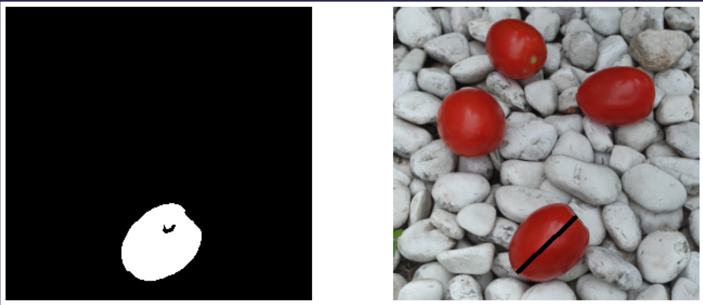

# Segmentación de objetos mediante K-means

El proyecto consiste en la segmentación de objetos para medir el diametro de estos utilizando técnicas de segmentación de imágenes.
La segmentación de los objetos se empleo usando **k-means** sin emplear **ninguna** librería.

---
## 1 - Segmentación de Colores
Como primer paso se deben segmentar la imágen por colores, los grupos en los que se segemento la imágen fueron 4, pero dependerá muchas veces de la calidad de la imágen.

---
## 2 - Segmentación de componentes
Aplicando K-means se obtienen los centroides de los componentes de colores y se proceden a realizar un umbralizado con estos valores para poder segmentar la imágen.

---
## 3 - Segmentación de objetos
Una vez que se tiene los diferentes componentes, seleecionamos aquella imágen que contienen los objetos que deseamos buscar (tomates) y segmentar.
Para poder realizar el siguiente paso realizaremos otro **K-means**, pero ahora basados en **coordenadas**.

---
## 4 - Medición distancias
Ya con los objetos segementandos en diferentes imágenes se procede a obtender los extremos de cada unos de los tomates que deseamos medir.
- Tomate 2 

- Tomate 4

## 5 - Resultados Finales
Una vez encontrados los extremos de los objetos, se gráfican el diametro de estos sobre la imagen final.
